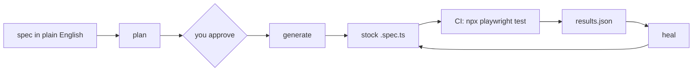

# playwright-wrapper

Write a test in plain English. Get a normal Playwright spec.

`playwright-wrapper` puts an LLM in front of Playwright for the parts that are slow and boring - finding locators on a live page, writing the first draft of a spec, fixing the spec after the UI moves, and pulling structured data off a page. Everything it produces is stock Playwright that runs with `npx playwright test`, in your CI, with no LLM anywhere near the run.

> Pre-release. The design is settled and the build is landing ticket by ticket.

## Why you would use it

- **You stop hand-writing locators.** The wrapper opens the real page, reads its accessibility tree, and proposes locators that exist on that page - not ones a model imagined.
- **You approve before code exists.** It shows you a plan in plain English first. You edit it, then it compiles. No surprise 200-line spec.
- **Broken tests come back with a fix attached.** Feed it a failed CI run and it proposes new locators for the steps that broke, with a written record of what it tried.
- **Same engine reads pages for you.** The browsing profile walks a public site, paginates, and returns structured JSON against a schema you declare.
- **It is cheap.** Text snapshots, not screenshots - no vision model. It runs on Ollama Cloud models by default.
- **No lock-in.** The output is a plain `.spec.ts`. Delete the wrapper tomorrow and your tests still run.

## How it fits together



The LLM works in the left half only. The right half is Playwright doing what Playwright does.

## Install

Needs Node 20 or newer.

```sh
npm i -g playwright-wrapper
```

From source:

```sh
git clone https://github.com/thegostev/playwright-wrapper.git
cd playwright-wrapper
npm install
npm link
```

Then set your key. All LLM config is read from the environment - never from flags, never logged.

```sh
export WRAPPER_OLLAMA_API_KEY=...   # from https://ollama.com
```

That is the only required variable. Check it worked:

```sh
playwright-wrapper --help
```

## Use it

### 1. Describe the test

A task spec is a short header plus a goal in your own words. Save it as `login.md`:

```
profile: test
target: https://app.example.com/login

Sign in with a valid account and land on the dashboard.
```

### 2. Get a plan

```sh
playwright-wrapper plan login.md > plan.md
```

The wrapper opens the target page in a real Chromium, snapshots it, and writes a step list with one locator per step:

```
profile: test
title: user can sign in
file: user-can-sign-in
next_id: s6
---
## steps

- id: s1
  action: go to the login page
  locator: none
  value: literal '/'
- id: s2
  action: fill the email field
  locator: getByLabel('Email')
  value: env:E2E_USER
  reason: label present on the form
- id: s3
  action: submit the form
  locator: getByRole('button', { name: 'Sign in' })
  reason: role=button, name="Sign in"
- id: s4
  action: assert the dashboard heading is shown
  locator: getByRole('heading', { name: 'Dashboard' })
  expect: visible
  reason: role=heading
```

Read it. Change what is wrong. This is the review step - the plan is the thing you approve, not the code.

### 3. Compile it

```sh
playwright-wrapper generate < plan.md
```

You get two files in your `testDir`, tracked in git:

- `user-can-sign-in.spec.ts` - a normal Playwright spec, first line stamped with the plan's hash
- `user-can-sign-in.plan.md` - the exact plan bytes that produced it

Generate refuses on a dirty working tree, so generated files never mix with work in progress.

### 4. Run it like any other test

```sh
npx playwright test
```

Nothing wrapper-specific runs here. Your CI needs no API key and no LLM.

### 5. Heal it when the UI moves

```sh
playwright-wrapper heal playwright-output/<project>/<run-id>/
```

Heal reads the failed run, proposes `{step_id, locator}` patches for the steps that broke, and writes a `.heal.md` record for every non-pass outcome. The ladder gets two tries - a fresh page snapshot, then the same snapshot plus why the first attempt failed. If the ladder is exhausted, the run escalates: with `OPENAI_API_KEY` set, one stronger last-resort attempt is made with full context (the page, why every attempt failed, and the proposals that were rejected); without it, heal stops there and hands the problem to you with what it tried. Every run ends in a machine-readable envelope naming the escalation reason and disposition.

Heal refuses to work on a run from a different commit than your checkout - patching against an app that has moved is how a wrong fix looks successful.

## Browsing and extraction

Same tool, different profile. Declare what you expect back:

```
profile: browsing
target: https://example.com/careers
browse:
  schema: ./roles.schema.json
  allowEmpty: false
  identityQuestion: is this the careers listing page?

List every open role with title, location, and link.
```

```sh
playwright-wrapper browse careers.md > roles.json
```

The loop navigates, snapshots, clicks, and pages through the list until it submits its extraction. The result is an outcome envelope: the rows, plus how they were judged (schema-verified, page identity, pagination completeness) and a pass or not-pass verdict. Exit code is `0` on pass, `1` on not-pass, so it drops into a shell pipeline.

No plan is created for browsing - there is no code to review, only a result.

## Your Playwright config

The consumer repo owns four settings:

```ts
import { defineConfig } from '@playwright/test';

export default defineConfig({
  testDir: './playwright-output/my-app/specs',   // where generated specs live
  use: { baseURL: process.env.BASE_URL },        // no hardcoded hosts
  captureGitInfo: true,                          // stamps the commit into reports
  reporter: process.env.CI ? [['json', { outputFile: 'results.json' }]] : 'list',
});
```

`baseURL` from env and `captureGitInfo` are what make a generated test portable and a heal run safe.

## Configuration

| Variable | What it does | Default |
|---|---|---|
| `WRAPPER_OLLAMA_API_KEY` | Ollama Cloud API key. Required. Never printed or written to disk. | - |
| `WRAPPER_OLLAMA_BASE_URL` | OpenAI-compatible endpoint. Point it anywhere that speaks the API. | `https://ollama.com/v1` |
| `WRAPPER_MODEL_MAIN` | Main model id | `glm-5.3-flash` |
| `WRAPPER_MODEL_FALLBACK` | Second model, used only after a failure | `glm-5.3` |
| `OPENAI_API_KEY` | If present, enables one stronger last-resort attempt when healing is stuck. Presence only - the value is never read into config, never logged. Without it, exhaustion goes straight to the terminal disposition. | - |
| `WRAPPER_OPENAI_BASE_URL` | Third-tier endpoint. Point it at any OpenAI-compatible API. | `https://api.openai.com/v1` |
| `WRAPPER_OPENAI_MODEL` | Third-tier model id | `gpt-5.6-sol` |

Exit codes: `0` ok, `1` config error or a not-pass result, `2` usage error.

## House rules

These are the promises the tool keeps, and the reason to trust its output:

- **Nothing is silently repaired.** A malformed plan or spec is refused with a line number. The wrapper never rewrites a model's broken output until it parses.
- **The model never assigns ids.** Step ids come from the harness, are append-only, and are never reused - so a heal patch always lands on the step it was meant for.
- **Locators are literals.** `page.locator`, raw CSS and XPath are rejected outright. Every locator is one readable, role- or label-based call.
- **Verdicts are computed, not reported.** Pass or fail is derived from the run trace, never from the model saying it did well.
- **CI stays dumb.** Generation, healing and browsing are local and interactive. CI runs the tests and nothing else.

## What it is not

- Not a replacement for the Playwright runner or its assertions - the specs run on stock Playwright.
- Not a hosted service. It calls an LLM API you configure; nothing is hosted here.
- Not a scraper for sites behind logins, captchas or anti-bot walls. Public pages are the supported case.

## Development

```sh
npm install
npm test        # node --test
```

Source layout: `bin/` is the CLI and its subcommand bodies, `src/` is the engine (browser bridge, LLM client, plan grammar, browse loop, drift guard), `spike/` holds the probes that proved each design decision on real pages, `test/` is the suite.

Design decisions are tracked as a [wayfinder map in Linear](https://linear.app/fyr/issue/FYR-245/llmplaywright-test-automation-wrapper-wayfinder-map).

## License

ISC
